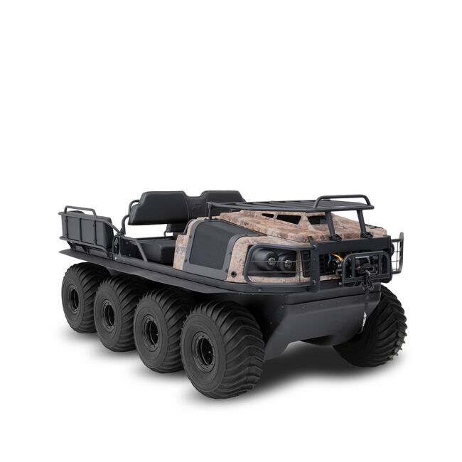

## Argo Conquest 950 Outfitter

The Argo Conquest 950 Outfitter is an 8x8 all-terrain vehicle designed for hunting and outdoor expeditions.

### Key Features:

*   **Engine:** VX 950 V-Twin, fan-cooled, EFI engine with 50 amps alternator output.
*   **Transmission:** Argo Admiral transmission with Instant Torque Clutch (ITC) for enhanced low-end torque and acceleration.
*   **Chassis:** 8x8 drive system with a heavy-duty full skid plate and brushguard.
*   **Braking:** Hydraulic steering brakes.
*   **Tires:** ARGO XT117 25x12-9 amphibious tires on steel beadlock rims.

### Capacity:

*   **Load Capacity (Land):** 1,170 lb (531 kg)
*   **Load Capacity (Water):** 470 lb (213 kg)
*   **Towing Capacity:** 2,000 lb (907 kg)
*   **Seating Capacity (Land):** 6
*   **Seating Capacity (Water):** 2

### Performance:

*   **Fuel Capacity:** 8.5 gal (32 L)
*   **Speed (Land):** 17 mph (27 Km/h)
*   **Speed (Water):** 3 mph (5 Km/h)

### Specifications:

*   **Weight:** 1,930 lb (875kg)
*   **Dimensions:**
    *   Length: 125 in (3,175 mm)
    *   Width: 65 in (1,651 mm)
    *   Height: 53 in (1,346 mm)
*   **Ground Clearance:** 9 in (228 mm) with tires, 10 in (254 mm) with tracks.

### Standard Features:

*   4000 lb winch
*   Front rack
*   Bilge pump
*   Auto chain lubrication
*   Easy access grease system (EAGS)

### Other Information:

*   **Color:** TrueTimber® Prairie Camo.
*   **Price:** $46,999 MSRP (excluding freight, setup, taxes, and registration).

The vehicle is described as amphibious and capable of navigating various terrains, including water, mud, and high altitudes. It is particularly marketed towards campers, lodge owners, and big-game guides for its load-carrying capabilities.
