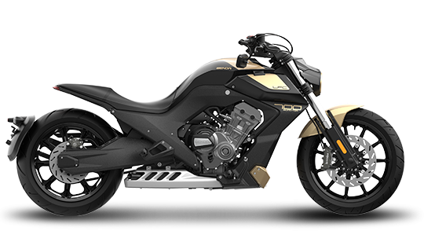

https://www.bendamotor.cn/Parameter/6
**Price Information:**

*   **National Unified Retail Price:** 46800.00 CNY

**Basic Parameters:**

*   **Model:** BD467MU
*   **Engine:** Inline Four-Cylinder, Four-Stroke, Water-Cooled, 700cc
*   **Max Horsepower:** 93.8 (PS)
*   **Max Power/Speed:** 69/1100 (kW/rpm)
*   **Max Torque/Speed:** 63/8500 (N·m/rpm)
*   **Fuel Tank Capacity:** 20 (L)
*   **Max Speed:** 195 (km/h)

**Chassis Parameters:**

*   **Frame Type:** Aluminum Alloy Frame
*   **Rear Swingarm:** Aluminum Alloy Rear Single-Sided Swingarm
*   **Front Suspension System:** KYB Inverted Front Forks
*   **Rear Suspension System:** KYB Central Rear Shock Absorber
*   **Dimensions (LxWxH):** 2430x880x1110 (mm)
*   **Wheelbase:** 1720 (mm)
*   **Curb Weight:** 235 (kg)
*   **Minimum Ground Clearance:** 160 (mm)

**Powertrain and Transmission:**

*   **Transmission:** International 6-Speed
*   **Clutch:** Wet Multi-Plate Clutch
*   **Drive Type:** Chain Drive

**Wheels and Brakes:**

*   **Front Brake System:** Dual Discs with Brembo Four-Piston Calipers
*   **Rear Brake System:** Single Disc with Brembo Two-Piston Caliper
*   **Front Wheel Specification:** 130/70-19
*   **Rear Wheel Specification:** 310/35-18
*   **Tire Type:** Tubeless Tires
*   **Wheels:** Aluminum Alloy Cast Wheels

**Active/Passive Safety Features:**

*   **ABS Anti-lock Braking System:** YES

