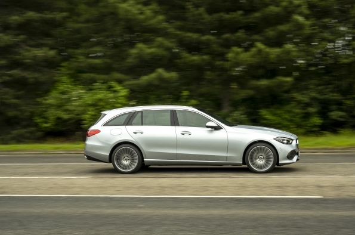

https://mercedes-benz-media.co.uk/releases/1433
*   **Pricing:**
    *   C-Class Saloon starts from £38,785 OTR for the C 200 Sport.
    *   C-Class Estate starts from £40,420 OTR for the C 200 Sport.
    *   The range-topping C 300 d AMG Line Premium Plus costs £52,125 for the Saloon and £53,425 for the Estate.
*   **Engines:** Four engine options are available at launch: C 200, C 300 (Saloon only), C 220 d, and C 300 d.
*   **Mild Hybrid System:** All engines are equipped with a 48V mild hybrid system featuring an Integrated Starter Generator (ISG) for energy recovery and improved efficiency, providing an additional 20 hp and 200 Nm of torque.
*   **Model Lines:** The C-Class is available in four model lines: Sport, AMG Line, AMG Line Premium, and AMG Line Premium Plus.
    *   **Sport:** Includes MBUX media system, 11.9-inch central display, 12.3-inch digital driver display, 17-inch alloy wheels, Agility Control comfort suspension, LED headlights, Active Lane Keeping Assist, Active Blind Spot Assist, Parking package with reversing camera, heated front seats, and wireless charging.
    *   **AMG Line:** Adds £1,380 and includes 18-inch AMG alloy wheels, privacy glass, AMG bodystyling, multifunction sports steering wheel, and visible twin exhaust pipes.
    *   **AMG Line Premium:** Adds £2,750 over AMG Line and includes 19-inch AMG alloy wheels, Adaptive Highbeam Assist Plus, Digital Light, ambient lighting, illuminated door sills, KEYLESS GO, Memory package, MBUX augmented reality for navigation, and a 360° camera.
    *   **AMG Line Premium Plus:** Starts from £46,700 and adds 19-inch AMG alloy wheels, a panoramic sunroof, head-up display, and Thermotronic four-zone climate control.
*   **Optional Tow Bar:** Estate models have an optional tow bar for £750.
*   **Availability:** On sale now, with first UK vehicles arriving late 2021.

